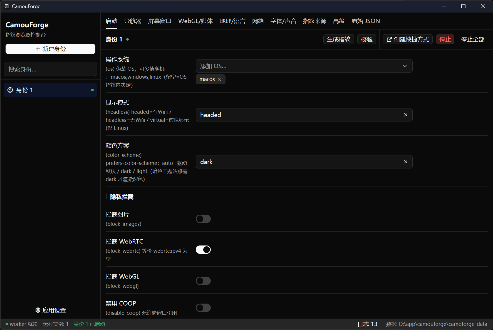

# CamouForge

**English** | [简体中文](README.zh-CN.md)

CamouForge is a native Windows desktop application for creating, editing, and running
[Camoufox](https://camoufox.com/) browser profiles. It combines a Rust/GPUI interface
with a supervised Python worker and exposes Camoufox launch options and fingerprint
configuration through a structured UI.



## Set it up with an AI agent

Copy the prompt below to your coding agent (ZCode, Claude Code, …) — replace the path with
your CamouForge folder. The agent will follow [AGENTS.md](AGENTS.md) to help you download,
deploy, and configure CamouForge:

```text
Read D:\path\to\camouforge\AGENTS.md and strictly follow its rules. Help me download and
set up CamouForge, then use COOKBOOK.md to guide me through the fingerprint configuration.
```

## Highlights

- Manage multiple browser identities and their persistent data independently.
- Edit launch, navigator, screen, WebGL/media, locale, network, font, audio, and raw
  fingerprint settings.
- Generate BrowserForge fingerprints, validate profiles, and choose installed Camoufox
  versions from the application.
- Launch, stop, and monitor browser instances from a native GPUI desktop interface.
- Create website shortcuts and route browser downloads to a configurable local folder.
- Download Camoufox releases in the application.
- Bootstrap and repair the Python worker environment automatically with
  [uv](https://docs.astral.sh/uv/). A system Python installation is not required for the
  portable build.

## Architecture

```text
GPUI desktop application (Rust)
  ├─ profile store and UI state
  ├─ Python environment bootstrap (uv + CPython 3.12)
  ├─ worker supervisor and JSON-RPC transport
  └─ Windows process/job management
                 │ stdio JSON-RPC
Python worker
  ├─ Camoufox SDK adapter
  ├─ profile translation and validation
  ├─ browser lifecycle management
  └─ download and browser patch helpers
```

- `crates/protocol`: profile model, RPC types, and fingerprint field registry.
- `crates/app`: GPUI application, storage, bootstrap, supervisor, and Windows integration.
- `worker`: Python RPC entry point and Camoufox integration modules.

## Platform and prerequisites

CamouForge currently targets Windows 10 or later.

To build from source, install:

- Rust stable
- Visual Studio Build Tools with **Desktop development with C++**
- [uv](https://docs.astral.sh/uv/)

The first portable launch needs network access to download the pinned uv release, managed
CPython 3.12, Python dependencies, and a Camoufox browser build selected in the app.
Subsequent launches can reuse the local environment.

## Build from source

```powershell
git clone https://github.com/Rycen7822/camouforge.git
cd camouforge
uv sync --frozen --no-dev --python 3.12
cargo build --release --locked
```

Run the development build:

```powershell
cargo run --release --locked
```

Create a portable directory:

```powershell
powershell -NoProfile -ExecutionPolicy Bypass -File scripts\package-portable.ps1
```

The package is written to `dist\camouforge\`. Keep `camoforge.exe`, `worker\`,
`pyproject.toml`, `uv.lock`, `uv.toml`, and `LICENSE` together. The application creates
`.venv`, `.camouforge-runtime`, and `camoforge_data` beside the executable; these runtime
directories are intentionally not included in the repository or package.

## Tests

```powershell
cargo fmt --all -- --check
cargo clippy --all-targets -- -D warnings
cargo test --all --locked
.venv\Scripts\python.exe tests\test_worker_unit.py
.venv\Scripts\python.exe verify_worker.py
```

The browser integration test in `tests/test_worker_integration.py` requires a real
Camoufox installation and an Xvfb display on Linux.

## Project layout

```text
camouforge/
├─ crates/app/                 # GPUI desktop application
├─ crates/protocol/            # shared profile and RPC model
├─ worker/                     # Python Camoufox worker
├─ tests/                      # worker unit and integration tests
├─ scripts/package-portable.ps1
├─ examples/example-profile.json # ready-to-use sample identity (Tokyo / macOS fingerprint)
├─ AGENTS.md                   # rules for AI agents assisting setup & configuration
├─ COOKBOOK.md                 # configuration reference for contributors
├─ pyproject.toml / uv.lock    # pinned worker environment
└─ Cargo.toml / Cargo.lock     # Rust workspace
```

## Local data and security

Profiles and runtime data stay local by default. Proxy credentials stored in profile JSON
files are currently plain text, so do not reuse sensitive credentials and protect the
`camoforge_data` directory. Use CamouForge only on systems and services you are authorized
to test.

## License

[MIT](LICENSE)
